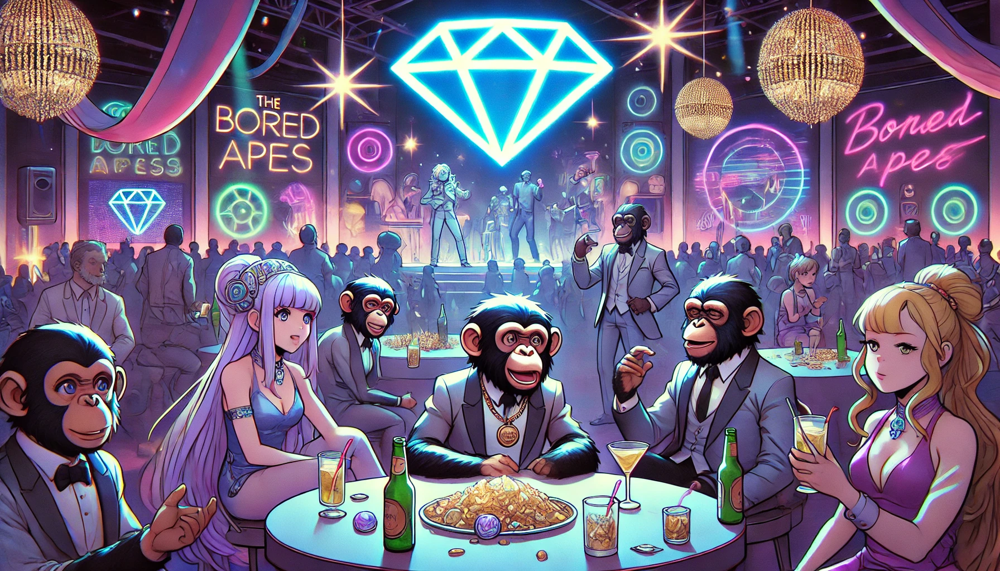

# The Beginning of the GemSTON Party

The wealthy Bored Apes planned a special party to celebrate their wealth. They decided to purchase a rare gem called GemSTON and hold a party centered around it. GemSTON, with its inherent beauty and mystery, perfectly embodied the theme of the party.

Lucas set the theme of the party, Mia artistically decorated the venue, Jake organized various programs for all Apes to enjoy, and Sophia ensured the safety and order of the party.

The party was a success, and the Bored Apes were captivated by the charm of GemSTON. They shared this special moment together, building even stronger friendships.

 
