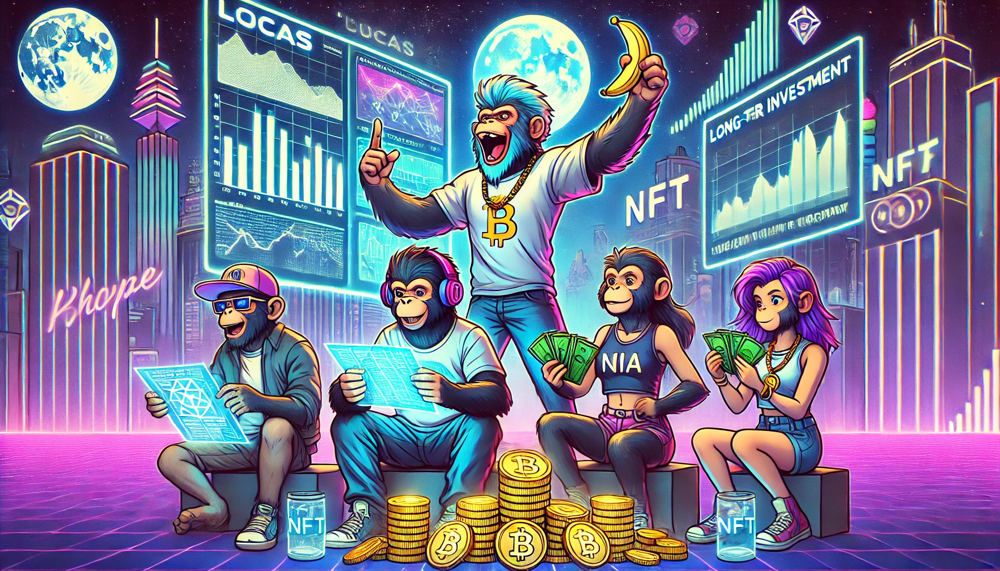

# 블록체인 투자로 부자가 된 Bored Ape들

루카스, 미아, 제이크, 소피아는 블록체인 기술의 잠재력을 일찍이 알아차렸습니다. 그들은 각자의 능력을 활용하여 블록체인 프로젝트에 투자하기 시작했습니다. 루카스는 새로운 기술을 탐구하며 유망한 프로젝트를 발굴했고, 미아는 예술적 감각을 살려 NFT 시장에 뛰어들었습니다.

제이크는 전략적 사고를 바탕으로 다양한 암호화폐에 투자하여 큰 수익을 올렸습니다. 소피아는 지혜로운 판단으로 장기적인 투자 계획을 세워, 안정적인 수익을 창출했습니다. 이들은 서로의 성공을 축하하며, 블록체인 세계에서 부를 쌓아갔습니다.

그들의 성공은 단순한 운이 아니었습니다. 각자의 능력과 협력의 결과로, Bored Ape들은 디지털 세계에서 가장 부유한 종족 중 하나로 자리 잡았습니다.

