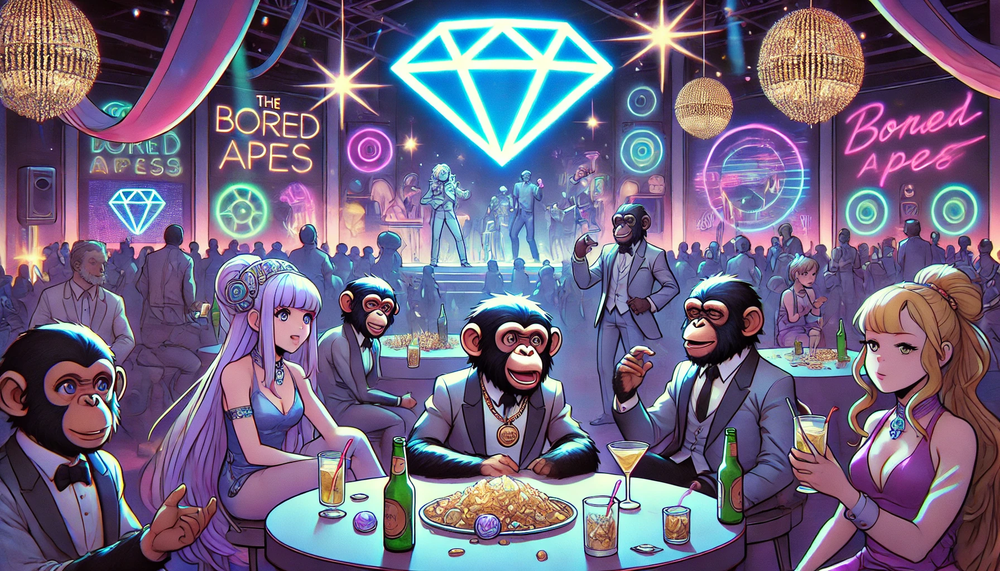

# GemSTON 파티의 시작

부자가 된 Bored Ape들은 그들의 부를 축하하기 위해 특별한 파티를 계획했습니다. 그들은 GemSTON이라는 희귀한 보석을 구입하여, 이를 중심으로 한 파티를 열기로 했습니다. GemSTON은 그 자체로 아름다움과 신비로움을 지닌 보석으로, 파티의 주제를 완벽하게 표현할 수 있었습니다.

루카스는 파티의 테마를 정하고, 미아는 파티 장소를 예술적으로 꾸몄습니다. 제이크는 파티의 진행을 맡아 모든 Ape들이 즐길 수 있도록 다양한 프로그램을 준비했습니다. 소피아는 파티의 안전과 질서를 책임졌습니다.

파티는 성공적이었고, Bored Ape들은 GemSTON의 매력에 빠져들었습니다. 그들은 이 특별한 순간을 함께 나누며, 더욱 끈끈한 우정을 쌓아갔습니다.

