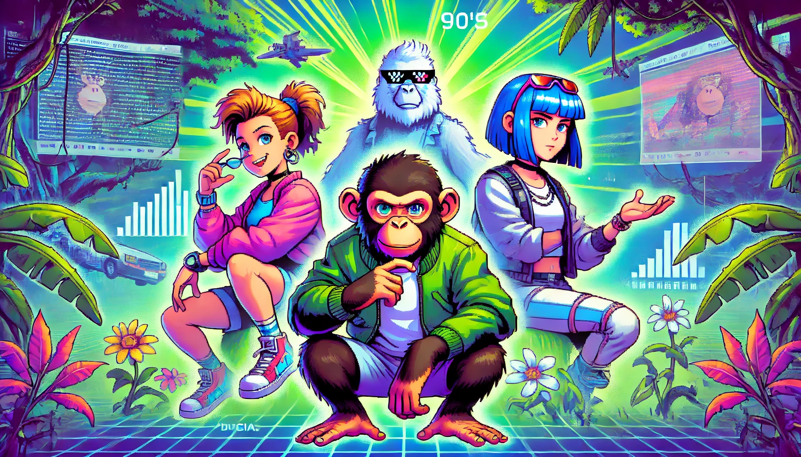

# The Birth of Bored Ape

Once upon a time, in the deep forests of the digital world, there lived a species known as Bored Ape. They were special beings born to overcome boredom. Each Bored Ape had a unique personality and abilities, and their birth coincided with the advancement of blockchain technology.

The first protagonist was 'Lucas', who had a curious nature always eager to explore new things. The second was 'Mia', an Ape with a keen artistic sense and full of creative ideas. The third was 'Jake', who possessed strategic thinking and leadership. Lastly, 'Sophia' was wise and thoughtful, respected by all other Apes.

They collaborated based on their individual traits, leading the development of the Bored Ape species. Their birth was not a mere coincidence but the beginning of a new era in the digital world.

