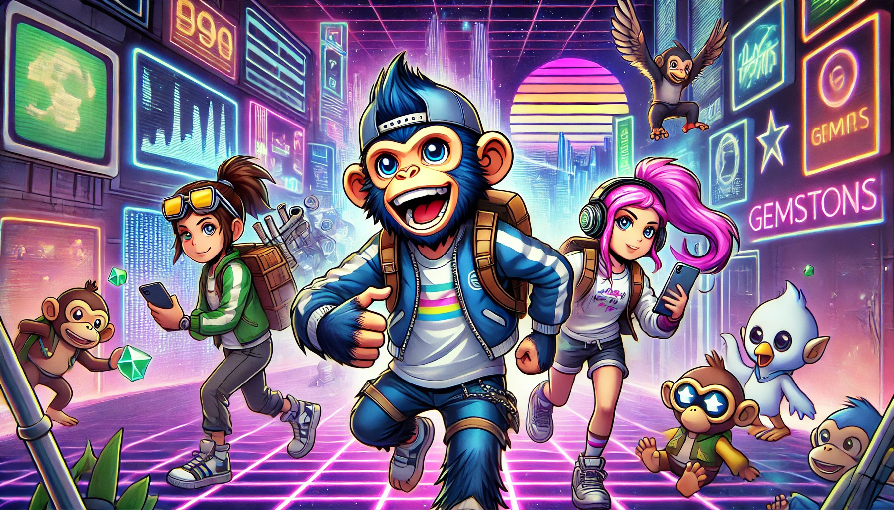

# The Start of a New Adventure

At the GemSTON party, the Bored Apes found friends whose hearts resonated with theirs. Lucas and Mia shared creative ideas and began planning new projects. Jake and Sophia, with their strategic thinking, planned a journey to find more GemSTONs.

They formed groups and decided to explore various parts of the digital world. Their goal was not just to find GemSTONs but to gain new experiences and knowledge. They trusted each other's abilities and embarked on the adventure together.

Their journey brought new challenges and opportunities, and the Bored Apes continued to grow. They explored the infinite possibilities of the digital world, writing a new history.

 
