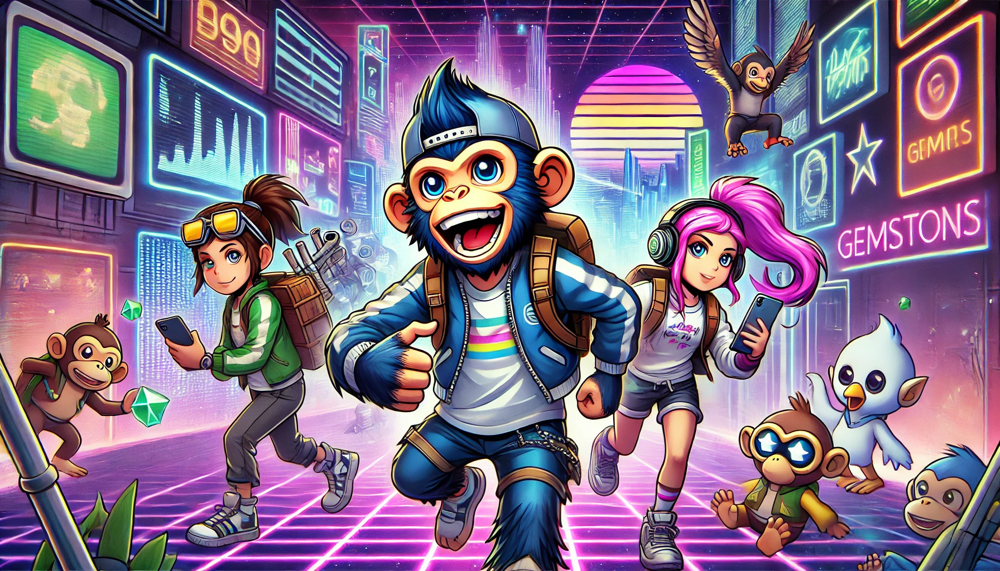

# 새로운 모험의 시작

GemSTON 파티에서 Bored Ape들은 서로의 마음이 잘 맞는 친구들을 발견했습니다. 루카스와 미아는 창의적인 아이디어를 공유하며, 새로운 프로젝트를 구상하기 시작했습니다. 제이크와 소피아는 전략적 사고를 바탕으로 더 많은 GemSTON을 찾기 위한 여행을 계획했습니다.

이들은 각자의 그룹을 형성하여, 디지털 세계 곳곳을 탐험하기로 했습니다. 그들의 목표는 단순히 GemSTON을 찾는 것이 아니라, 새로운 경험과 지식을 쌓는 것이었습니다. 이들은 서로의 능력을 믿고, 함께 모험을 떠났습니다.

그들의 여행은 새로운 도전과 기회를 가져다주었고, Bored Ape들은 더욱 성장해 나갔습니다. 이들은 디지털 세계의 무한한 가능성을 탐구하며, 새로운 역사를 써 내려갔습니다.

